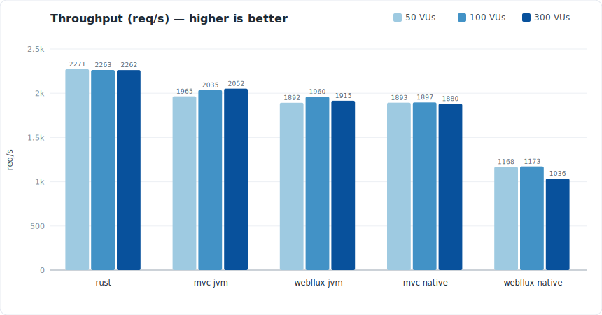
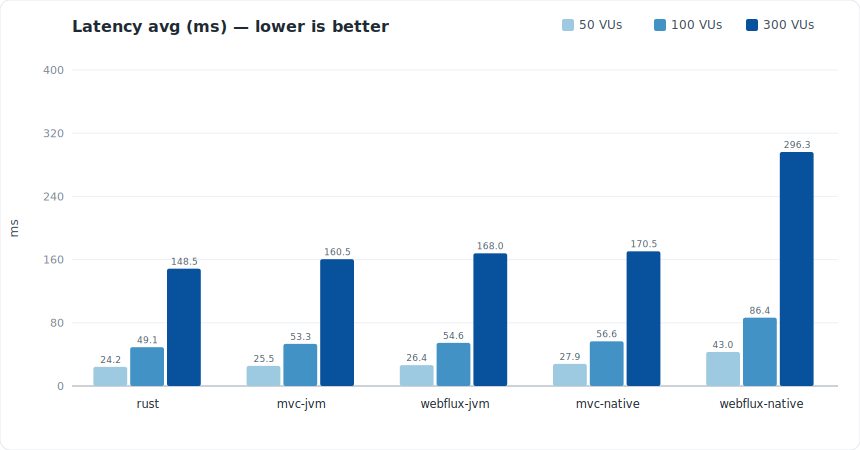
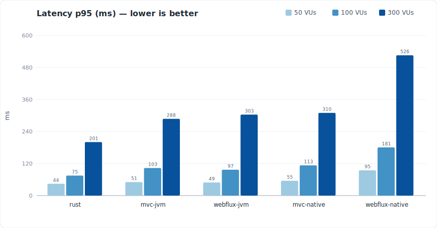
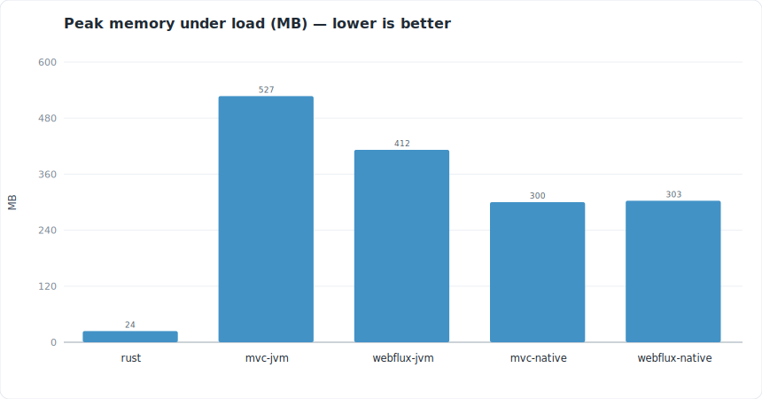
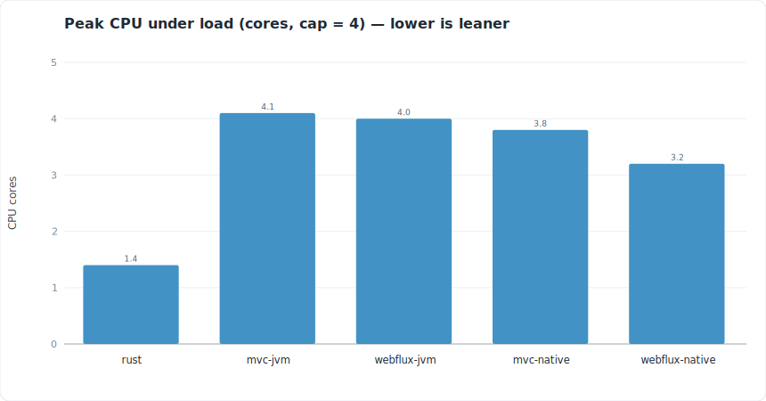
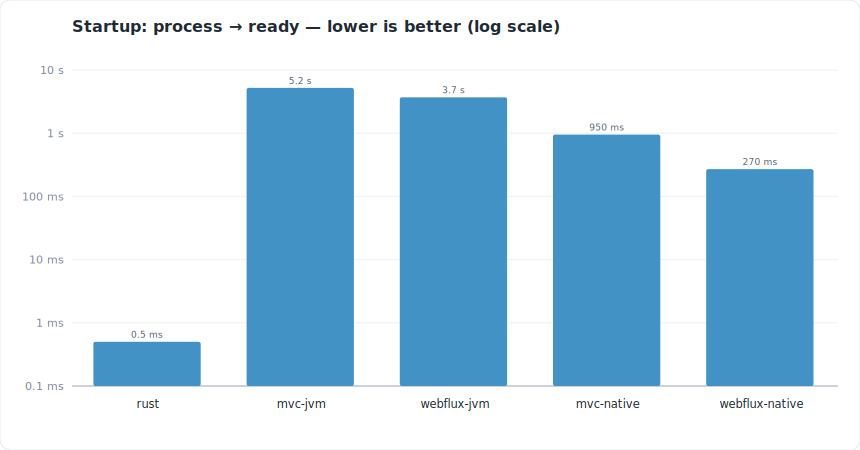
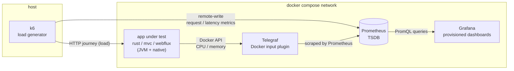

# Rust for Java Developers

A live-coding talk that teaches Rust to Spring Boot developers by **migrating the same application** from Java to Rust, drawing a parallel for each Rust concept with its Spring Boot/Java equivalent. It’s aimed at a beginner–intermediate audience, so it stays away from Rust’s deeper corners.

The application under all implementations is a small **Support Ticket System** with an identical HTTP contract:

| Method  | Path                              | Description                                              |
|---------|-----------------------------------|---------------------------------------------------------|
| `POST`  | `/tickets`                        | Create a ticket                                         |
| `GET`   | `/tickets?status=&priority=`      | List tickets (`LIMIT 100`), optional filters            |
| `GET`   | `/tickets/{id}`                   | Fetch one ticket                                        |
| `PATCH` | `/tickets/{id}/status`            | Update a ticket’s status                               |
| `GET`   | `/tickets/stats`                  | Counts grouped by status **and** priority (one `GROUPING SETS` query) |

Beyond teaching the language, the repo also **benchmarks** the implementations against each other (see [Benchmark](#benchmark)).

---

## Directory structure

```
.
├── rust/                  # Rust impl — Axum + Diesel (async) + deadpool, Tokio
├── springboot-mvc/        # Spring MVC + Spring Data JPA (blocking) — the "before"
├── springboot-webflux/    # Spring WebFlux + R2DBC (reactive) — the rewrite
│                          #   each Spring app builds two ways:
│                          #     Dockerfile         → JVM jar
│                          #     Dockerfile-native  → GraalVM native image
├── database/              # init_database.sh (schema + indexes) and seed.sql (10k rows)
├── k6/                    # load_testing.js (journey) + run-bench.sh + summaries/ (run reports)
├── telegraf/              # telegraf.conf — per-container CPU/mem via the Docker API
├── prometheus/            # prometheus.yml — scrapes Telegraf, receives k6 remote-write
├── grafana/               # provisioned Prometheus datasource + benchmark dashboards
├── collection-bruno/      # Bruno API collection for the endpoints
├── slides/                # talk slides
├── goals.md               # talk notes — Rust ↔ Java feature parallels
└── docker-compose.yml     # the whole stack (apps + Postgres + observability)
```

### The benchmark targets

Two Spring codebases — the blocking "before" and the reactive rewrite — each built as a JVM jar **and** a GraalVM native image, plus the Rust app. Five targets in all:

| Target                       | Stack                                          |
|------------------------------|------------------------------------------------|
| `springboot-mvc`             | Spring MVC + Spring Data JPA (JVM)             |
| `springboot-mvc-native`      | Spring MVC + Spring Data JPA (GraalVM native)  |
| `springboot-webflux`         | Spring WebFlux + R2DBC (JVM)                    |
| `springboot-webflux-native`  | Spring WebFlux + R2DBC (GraalVM native)        |
| `rust`                       | Axum + Diesel-async + deadpool (Tokio)         |

---

## Rust ↔ Java parallels

The core teaching device (full version in [`goals.md`](goals.md)):

| Rust          | Java / Spring Boot | Concept                           |
|---------------|--------------------|-----------------------------------|
| `Cargo`       | Maven              | Build tool / dependency manager   |
| `let`         | `var` / `String`   | Variable declaration              |
| `mut`         | `final` (inverse)  | Mutability                        |
| `&`           | —                  | Ownership & borrowing             |
| Compiler      | Garbage collector  | Memory management                 |
| `struct`      | `class`            | Custom data types                 |
| `enum` / `match` | `enum` / `switch` | Pattern matching                  |
| `Option<T>`   | `Optional` / `null`| Absence of a value                |
| `Result<T,E>` | `throw` / Exception| Error handling                    |
| `trait`       | `interface`        | Shared behavior                   |
| iterators / closures | streams / lambdas | Functional features          |

---

## Running it

Everything runs through Docker Compose:

```bash
docker compose up -d
```

| Service                          | Port  | Stack                                      |
|----------------------------------|-------|--------------------------------------------|
| `rust-app`                       | 1337  | Axum + Diesel                              |
| `springboot-mvc-app`             | 8081  | Spring MVC + JPA (JVM)                      |
| `springboot-mvc-native-app`      | 8082  | Spring MVC + JPA (GraalVM native)          |
| `springboot-webflux-app`         | 8083  | Spring WebFlux + R2DBC (JVM)               |
| `springboot-webflux-native-app`  | 8084  | Spring WebFlux + R2DBC (GraalVM native)    |
| `database`                       | 5432  | PostgreSQL 18                              |
| `prometheus`                     | 9090  | metrics store                              |
| `grafana`                        | 3000  | dashboards (`admin` / `admin`)             |
| `telegraf`                       | 9273  | container metrics exporter                 |

On first start, the database is created, the `tickets` table + indexes are built ([`database/init_database.sh`](database/init_database.sh)), and 10,000 rows are seeded ([`database/seed.sql`](database/seed.sql)).

---

## Benchmark

The benchmark compares the implementations on **throughput, latency (p90/p95/p99 per endpoint), failure rate, and CPU/memory** under load.

### Methodology

The whole point is that every target is measured under **identical conditions**, so differences are about the runtime/framework — not the test harness.

**Test machine:** Intel Core i7-11800H (8 cores / 16 threads @ 2.3 GHz), 16 GB RAM, Samsung PM9A1 NVMe SSD, Windows 11 Pro (build 26200); Docker Engine via WSL2. Each app container is capped at **4 CPU / 2 GB**.

- **k6 on the host → apps in Docker.** The load generator ([`k6/load_testing.js`](k6/load_testing.js)) runs natively on the host and drives each app through its published port. Each app under test runs as a container.
- **Same environment & resources for every target.** All apps run as containers on the same Docker network, talk to the **same** Postgres, and are capped at **identical limits (4 CPU / 2 GB)**. Co-locating the apps with the database removes the host↔DB network hop from every request, and the equal caps make CPU/memory directly comparable.
- **Clean database state per run.** Before each target, the DB is reset to the same fixed dataset (`TRUNCATE … RESTART IDENTITY` + 10,000 rows from [`database/seed.sql`](database/seed.sql)) so every app sees identical data.
- **Warm-up is excluded from the numbers.** Each run has a warm-up phase (matters for the JVM’s JIT) followed by the measured *benchmark* phase; only the benchmark phase feeds the per-endpoint latency trends.
- **One user journey, deterministic across apps.** Each iteration runs `list → create → get → update status → get → stats`, with the `list` filter varied by a sequence number so the request mix is identical for every target.

### Results

> Runs at **50 / 100 / 300 VUs** on the test machine described above (apps capped at 4 CPU / 2 GB). Numbers are **relative** (a runtime/framework comparison), not absolute. **Failure rate was 0%** at every level. Throughput is `http_reqs/s`; latency is the measured (post-warm-up) `http_req_duration` p95. All apps share an **equal 10-connection pool**, so throughput plateaus once that pool saturates — this measures per-request efficiency under fixed concurrency, not raw scalability.

Charts below are generated from the summaries by [`k6/make-charts.mjs`](k6/make-charts.mjs) (`node k6/make-charts.mjs` to refresh). Bars are grouped by load — light → dark = 50 → 100 → 300 VUs.

**Throughput — requests/s** (higher is better; near-flat across loads — everyone is pool-bound)



**Latency — avg (ms)** (lower is better)



**Latency — p95 (ms)** (lower is better)



**Resource use & startup** — startup is load-independent; resource figures are the peak observed across the runs.







*CPU = Telegraf `docker_container_cpu_usage_percent` (100% = 1 core); memory = `docker_container_mem_usage`; startup = each app's own "ready" log (Spring's "process running for", Rust's "Started in"). Startup uses a **log scale** — the range is 0.5 ms to 5.2 s.*

**Takeaways**

- **Rust leads on throughput *and* efficiency** — most req/s at every load, while using only ~1.4 cores and 24 MB. Its throughput is **flat at ~2265 req/s** and it never approaches the CPU cap: it's pool/DB-bound with huge headroom, not CPU-bound — and it keeps the lowest p95 at every level.
- **Throughput plateaus; load shows up as latency.** With an equal 10-connection pool, raising VUs mostly inflates p95 (queueing) rather than req/s — the comparison is about per-request cost under fixed concurrency.
- **Native wins startup and memory by a wide margin** — both native images are ready in under a second (vs 3–5 s on the JVM) and use ~300 MB (vs 410–530 MB).
- **…but native roughly halves WebFlux throughput** (≈1170 vs ≈1900 on the JVM) and it **degrades further under load** (down to 1036 req/s at 300 VUs). GraalVM CE compiles ahead-of-time (no JIT) and ships only the stop-the-world **Serial GC**; the allocation-heavy, polymorphic **reactive** stack is the worst case for both, while the flatter **blocking** MVC stack is nearly unaffected (mvc-native ≈ mvc-JVM). Mitigation = Oracle GraalVM's **G1 + PGO** (see [`Dockerfile-native`](springboot-webflux/Dockerfile-native)).
- **The JVM is very competitive on throughput once warm** (≈1900–2050 req/s) — it pays instead in **startup** (seconds) and **memory** (the heaviest of all).

**Why webflux-native starts ~2.5× faster than mvc-native** (0.27 s vs 0.95 s, both AOT-compiled): MVC's JPA/Hibernate bootstrap — building the entity metamodel and `EntityManagerFactory` — is far heavier than WebFlux's R2DBC setup. Native compilation makes both fast, but JPA's extra initialization still shows. The same lean reactive stack that *loses* on native throughput *wins* on native startup.

### Running a comparison

```bash
docker compose up -d

# benchmark each target, re-seeding the DB to the same state before every run:
for target in rust springboot-mvc springboot-mvc-native springboot-webflux springboot-webflux-native; do
  docker compose exec -T database psql -U postgres -d intro-to-rust < database/seed.sql
  ./k6/run-bench.sh "$target" -u 100 -d 2m
done
```

`run-bench.sh <rust | springboot-mvc | springboot-mvc-native | springboot-webflux | springboot-webflux-native> [-u vus] [-d duration] [-w warmup]` drives k6 against the already-running container for that target.

### Reports

- **Per-run JSON summary** — each run writes `k6/summaries/summary-<vus>-<target>.json` (e.g. `summary-100-rust.json`, `summary-300-springboot-webflux.json`).
- **Time-series metrics** — k6 streams to Prometheus via remote-write, tagged with:
  - `target` — one of `rust`, `springboot-mvc`, `springboot-mvc-native`, `springboot-webflux`, `springboot-webflux-native`
  - `testid` — `<target>-<vus>-<datetime>` (used to select a specific run in Grafana)

### Observability stack & dashboard



*Arrows follow the direction the data flows (toward Prometheus, then Grafana).*

- **Load metrics** (throughput, per-endpoint p90/p95/p99, failure rate) come from **k6** via Prometheus remote-write.
- **Resource metrics** (per-container CPU/memory) come from **Telegraf**, which reads them from the Docker API (storage-driver agnostic — no cAdvisor needed) and labels them by `container_name`.
- **Grafana** (provisioned datasource + dashboards under [`grafana/`](grafana/)) renders the comparison. Select runs with the `testid` / `target` variables, and widen the time range to span the runs you’re comparing; resource panels are scoped by `container_name`.

---

## License

See [LICENSE](LICENSE).
